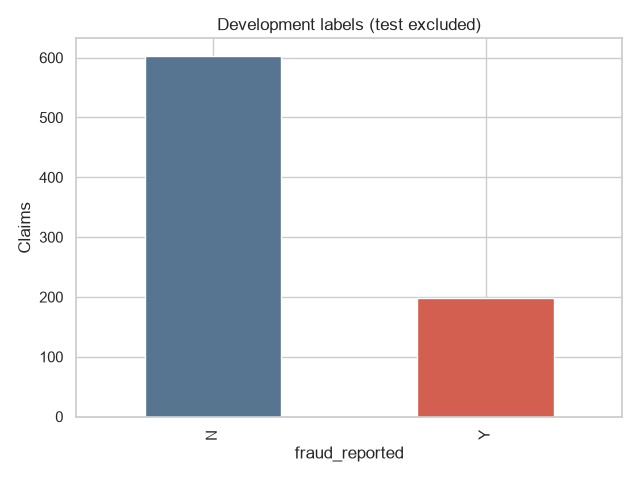
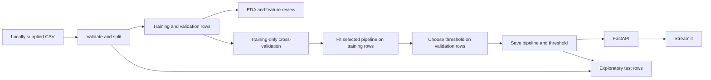

# ClaimLens

**Insurance claim review with scikit-learn, FastAPI, and Streamlit.** ClaimLens trains on a locally supplied insurance claims CSV and scores completed claim records for human fraud review. It includes reproducible data checks, exploratory analysis, model comparison, a saved inference pipeline, an API, and a simple web interface.

| Project snapshot | Verified value |
| --- | --- |
| Dataset | 1,000 claims; 247 labelled `Y` (fraud), 753 labelled `N` |
| Selected model | Class-weighted logistic regression |
| Review threshold | 0.34, selected on validation data |
| Training CV average precision | 0.608 mean across three folds |
| Intended use | Review assistance after initial damage assessment |



> [!IMPORTANT]
> A flag is **not proof of fraud**. The reported test result is exploratory because an earlier result from the same test partition was viewed before the severity feature was added. A new independent dataset is needed for an unbiased final estimate.

The model score is uncalibrated, and this project does not establish operational accuracy or fairness. The original CSV is excluded from Git because its redistribution rights are unknown; users must supply a compatible file locally.

## Workflow



The API and UI use the same `src.inference.predict_record` path. Imputation, one-hot encoding, and logistic scaling live inside the fitted scikit-learn pipeline. The API loads the saved bundle once per process; requests do not retrain or refit anything.

## Repository layout

| Path | Purpose |
| --- | --- |
| `config/config.yaml` | Dataset path, feature lists, split seed, fold count, and selection settings. |
| `src/` | Validation, EDA, preprocessing, modelling, explanations, inference, API, and UI. |
| `scripts/` | Generate a synthetic request, execute notebooks, export safe reports, and verify runtime. |
| `notebooks/01_*.ipynb` through `05_*.ipynb` | Current ordered analysis notebooks with reviewed outputs. |
| `reports/figures/`, `reports/eda_findings.json` | Aggregate development EDA. |
| `reports/results_summary.json`, `reports/coefficients.json` | Public aggregate evaluation and conditional feature associations. |
| `reports/example_request.json` | Synthetic request assembled from training medians and modes. |
| `reports/verification.md` | Detailed executed checks and limitations. |
| `tests/` | Split, bundle metadata, inference, API, and UI transport checks. |
| `docker/`, `docker-compose.yaml` | Two service images and their Compose wiring. |

The CSV, `data/processed/`, `reports/metrics/`, and `models/fraud_pipeline.joblib` are generated or supplied locally and excluded from Git. Historical `archive/`, `notebooks/legacy/`, `assets/`, and `pict/` remain on the working machine but are outside the intended public release. The five current figures are small aggregate plots retained for this README.

## Dataset

Place a compatible file at `data/dataset/insurance_claims.csv`. The inspected local CSV has **1,000 rows and 40 columns**, with `fraud_reported` labels **753 `N` and 247 `Y`**. Its SHA-256 is `0a7d71bf1b07b6ace30e531a6ae460e796ec2e4dc86f976c6a7f7d08e1b68bb1`. The pipeline requires the target, `policy_number` for split overlap checks, and every feature named in [config/config.yaml](config/config.yaml). Inference needs only the configured features, never the target or policy number.

There are no exact duplicate rows, and all 1,000 policy numbers are unique. `_c39` is entirely empty. The literal `?` occurs 360 times in `property_damage`, 343 times in `police_report_available`, and 178 times in `collision_type`. One policy bind date is later than its incident date. `total_claim_amount` equals the sum of the three component claim amounts for every row. The model excludes the empty column, identifiers and address, ZIP, redundant total, dates, sex, and police report availability.

The source, sampling process, label audit, and redistribution rights of this CSV were not established. No download URL or dataset license is supplied. A new user must obtain and place a compatible CSV legally; do not add the local raw file to a public repository without confirming rights.

## Setup and quick start

The full verification used **fresh Python 3.13.1 virtual environments on Windows** and the exact versions in [requirements.txt](requirements.txt). Python 3.13 is the documented target. Run these commands from the project root. The `.venv` layout below was tested in a clean release copy. Linux/macOS commands are provided for convenience and were **not executed** here.

### Windows PowerShell

```powershell
python -m venv .venv
.\.venv\Scripts\python.exe -m pip install -r requirements.txt
.\.venv\Scripts\python.exe -m pip check
# Obtain a compatible CSV, then place it at data/dataset/insurance_claims.csv.
.\.venv\Scripts\python.exe -m src.data_pipeline
.\.venv\Scripts\python.exe -m src.eda
.\.venv\Scripts\python.exe -m src.modelling
.\.venv\Scripts\python.exe -m scripts.make_example
.\.venv\Scripts\python.exe -m src.explain
.\.venv\Scripts\python.exe -m scripts.export_public_reports
.\.venv\Scripts\python.exe -m scripts.run_notebooks
.\.venv\Scripts\python.exe -m pytest -q
.\.venv\Scripts\python.exe -m scripts.verify_runtime
```

The final command starts and stops its own API and Streamlit processes and checks a form submission. Ports 8080 and 8501 must be free. For interactive use, keep these commands running in separate PowerShell terminals:

```powershell
.\.venv\Scripts\python.exe -m uvicorn src.api:app --host 127.0.0.1 --port 8080
.\.venv\Scripts\python.exe -m streamlit run src/dashboard.py --server.address=127.0.0.1 --server.port=8501
```

### Linux/macOS equivalent, not verified here

```bash
python3.13 -m venv .venv
.venv/bin/python -m pip install -r requirements.txt
.venv/bin/python -m pip check
# Obtain a compatible CSV, then place it at data/dataset/insurance_claims.csv.
.venv/bin/python -m src.data_pipeline
.venv/bin/python -m src.eda
.venv/bin/python -m src.modelling
.venv/bin/python -m scripts.make_example
.venv/bin/python -m src.explain
.venv/bin/python -m scripts.export_public_reports
.venv/bin/python -m scripts.run_notebooks
.venv/bin/python -m pytest -q
.venv/bin/python -m scripts.verify_runtime
```

On Linux/macOS, start `uvicorn src.api:app --host 127.0.0.1 --port 8080` and `streamlit run src/dashboard.py --server.address=127.0.0.1 --server.port=8501` with `.venv/bin/python -m` in separate terminals.

## Reproducing the analysis

`src.data_pipeline` validates the CSV and writes `data/processed/{train,validation,test}.csv` plus a private audit in `reports/metrics/data_audit.json`. Structural quality checks use the full CSV. Target associations and plots from `src.eda` use development rows only: [labels](reports/figures/target_distribution.png), [missing placeholders](reports/figures/missingness.png), [claim amounts](reports/figures/claim_amounts.png), [severity](reports/figures/severity_association.png), and [hobbies](reports/figures/hobby_association.png). Plots describe associations, not causes.

`src.modelling` fits all configured candidates and writes the trusted local `models/fraud_pipeline.joblib` and private `reports/metrics/model_results.json`. `src.explain` writes transformed logistic coefficients. `scripts.export_public_reports` copies only aggregate results to [results_summary.json](reports/results_summary.json) and [coefficients.json](reports/coefficients.json). `scripts.make_example` creates a synthetic request using training medians and modes, not an individual CSV row. `scripts.run_notebooks` executes each numbered notebook in a fresh kernel; notebook 05 reads the frozen results and does not train or overwrite the release bundle. `scripts.make_notebooks` recreates the concise notebook source if needed; rerun `scripts.run_notebooks` afterward to save current outputs.

The seed is 42, with stratified **600 training / 200 validation / 200 test** rows. Unique policy identifiers do not overlap. There is no repeated policy entity in this CSV. Each of three training CV folds fits its own imputer, encoder, and scaler; validation and test rows are never resampled. No sampler is used. The candidate set contains a dummy prior baseline, logistic regression with and without class weighting, random forests with and without class weighting, and a small histogram gradient boosting model. Mean training CV **average precision** selects the classifier. The validation set selects a threshold from 0.05 to 0.95 by fraud F2. The fitted 600-row pipeline is saved without a later refit.

`incident_severity` is included because the intended prediction point is after initial damage assessment. Its strong association with the label makes availability at that point essential. The largest fitted coefficients also include chess and cross-fit hobbies; these may be dataset artifacts or proxies. Coefficients are conditional associations, not causal effects.

## Verified results and interpretation

The fresh environment reproduced the previous numbers. The selected model is class-weighted logistic regression and the validation-selected threshold is **0.34**. `Y` is the fraud class. The test figures are **exploratory**: a previous feature set was evaluated on this same test partition before severity was added. Rerunning or reshuffling this dataset cannot restore an independent final holdout. Obtain a new, independently collected and ideally time-separated set before claiming an unbiased final estimate.

| Evaluation | Rows (`N`/`Y`) | Fraud precision | Fraud recall | Fraud F1 | Fraud F2 | ROC-AUC | Average precision |
| --- | ---: | ---: | ---: | ---: | ---: | ---: | ---: |
| Training CV, model selection | 600 (451/149) | — | — | — | — | — | **0.608 mean**, 0.069 fold SD |
| Validation, threshold 0.34 | 200 (151/49) | 0.608 | 0.918 | 0.732 | 0.833 | 0.897 | 0.735 |
| Exploratory test, threshold 0.34 | 200 (151/49) | 0.528 | 0.776 | 0.628 | 0.709 | 0.820 | 0.540 |

The dummy prior's training CV average precision was 0.248. At threshold 0.34, the validation confusion matrix is `[[122,29],[4,45]]` and the exploratory test matrix is `[[117,34],[11,38]]`; rows are actual `[N,Y]` and columns predicted `[N,Y]`. At 0.5, validation precision/recall are 0.656/0.857. Lowering the threshold catches three more validation fraud labels and adds seven false flags. The 49 positive test examples, limited provenance, and unusually strong category associations add substantial uncertainty. Scores are **uncalibrated model outputs**, not real-world fraud probabilities.

## API and Streamlit

The API exposes `GET /health` (process health), `GET /ready` (bundle load and model name), and `POST /predict` (one claim). `POST /predict` requires all configured feature keys. Unknown categories are accepted by one-hot encoding. `?`, empty strings, and nulls are treated as missing where supported; numeric values that cannot be parsed and missing keys return HTTP 422. A missing or incompatible bundle returns an actionable HTTP 503. Never load an untrusted joblib file.

This valid synthetic request is also saved in [example_request.json](reports/example_request.json):

```json
{
  "months_as_customer": 204.0, "policy_annual_premium": 1265.78,
  "policy_deductable": 1000.0, "umbrella_limit": 0.0,
  "capital-gains": 0.0, "capital-loss": -22300.0,
  "incident_hour_of_the_day": 12.0, "number_of_vehicles_involved": 1.0,
  "bodily_injuries": 1.0, "witnesses": 2.0,
  "injury_claim": 6820.0, "property_claim": 6615.0,
  "vehicle_claim": 41700.0, "auto_year": 2005.0,
  "policy_state": "OH", "policy_csl": "250/500",
  "insured_education_level": "JD", "insured_occupation": "machine-op-inspct",
  "insured_hobbies": "paintball", "insured_relationship": "other-relative",
  "incident_type": "Multi-vehicle Collision", "collision_type": "Rear Collision",
  "incident_severity": "Minor Damage", "authorities_contacted": "Police",
  "incident_state": "NY", "incident_city": "Columbus",
  "property_damage": "NO", "auto_make": "Suburu", "auto_model": "A3"
}
```

With the API running, this PowerShell command submits it:

```powershell
Get-Content reports/example_request.json -Raw | Invoke-RestMethod -Method Post -ContentType 'application/json' -Uri 'http://127.0.0.1:8080/predict'
```

The verified response is `{"prediction":"N","fraud_score":0.16300624029119856,"threshold":0.34,"review_recommended":false}`. The score is compared with the saved threshold. The Streamlit page at `http://127.0.0.1:8501` displays the synthetic JSON, lets the user edit and submit it, then shows the score and review flag. It calls `FRAUD_API_URL` or, by default, `http://localhost:8080`. In Compose, this variable is `http://api:8080`.

## Docker

The generated model is deliberately excluded from Git. **Train locally first** so `models/fraud_pipeline.joblib` exists, and run `scripts.make_example` before building the UI image. Compose mounts `./models` read-only into the API container; neither image copies an undeclared local model or trains at startup. The API health check waits for model readiness before starting Streamlit.

```powershell
docker compose config --quiet
docker compose build
docker compose up -d
docker compose ps
Get-Content reports/example_request.json -Raw | Invoke-RestMethod -Method Post -ContentType 'application/json' -Uri 'http://127.0.0.1:8080/predict'
docker compose down
```

Compose configuration **passed**. Docker image build and container behavior remain **blocked and unverified** because no Docker daemon was running on the verification machine. The commands above require a working Docker daemon; no system-level Docker change was made.

## Verification and limits

Run `python -m pytest -q` with your environment's Python after generating the bundle and example. The clean environment checks covered dependencies, full data and model execution, five notebooks, four focused tests, fresh-process inference, live API requests, and a Streamlit form submission through the API. A clean release-copy run is recorded in [reports/verification.md](reports/verification.md). There is no Python package build step in this repository; installation, execution, and the unavailable Docker build are the applicable build checks.

- Missing CSV: place a compatible licensed file at the configured path, then rerun preparation and training. The pipeline reports the expected path.
- Missing model: run `python -m src.modelling`, then restart the API. `/ready` reports 503 until a valid bundle exists.
- Import or dependency error: run the documented virtual environment's Python and `python -m pip check` from the project root. Streamlit must start with the documented command.
- Occupied ports: stop your own service using 8080 or 8501, or change the service and `FRAUD_API_URL` settings together.
- Docker failure: check `docker info` and daemon availability. Compose parsing alone does not verify images or containers.
- Model performance: the exploratory test, small sample, unknown sampling and label process, and unverified score calibration preclude operational claims. Human review is required.

The local CSV, processed partitions, model bundle, identifier-bearing private audit, virtual environments, logs, archive, and historical notebook/figure material are excluded by [.gitignore](.gitignore); the Docker context has its own [.dockerignore](.dockerignore). Public reports contain aggregates and a synthetic request. No project or dataset license or required attribution was discoverable in the inspected project files, so none is invented here. If you want others to reuse the code, choose a project license separately after reviewing its terms.
